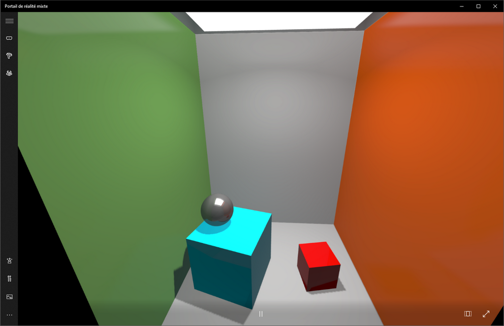

# Harfang Lua VR Example

This code demonstrates how to create and display a simple 3D scene in virtual reality using the Harfang 3D engine and Lua. It initializes an OpenVR-compatible environment, renders a prebuilt scene to both VR eyes using framebuffers, and displays the rendered eye textures in a desktop window. The example includes basic scene creation with a camera, models, and shaders, making it a starting point for experimenting with VR development in Harfang.

## How to run it

- Clone the repository
- Enters the `app/`folder
- run `1-build.bat` (will compile the assets for the runtime)
- run `2-start.bat` (will invoke the Lua interpreter and start the main Lua script)

Feel free to open the `app/` folder on VSCode and run the `main.lua` script. 
Recommended VSCode Lua extension: https://marketplace.visualstudio.com/items?itemName=actboy168.lua-debug
